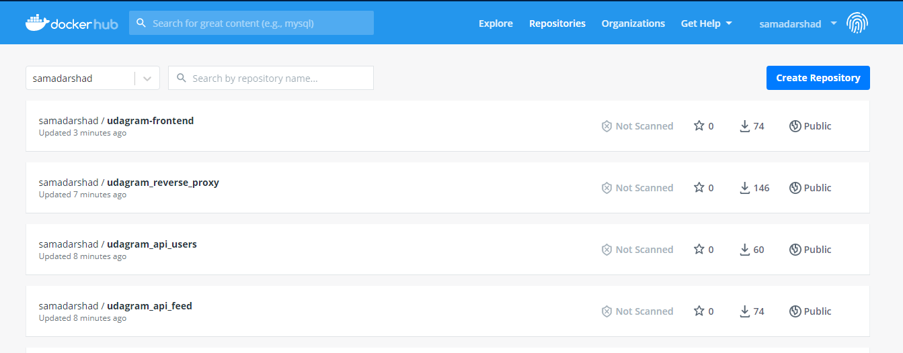
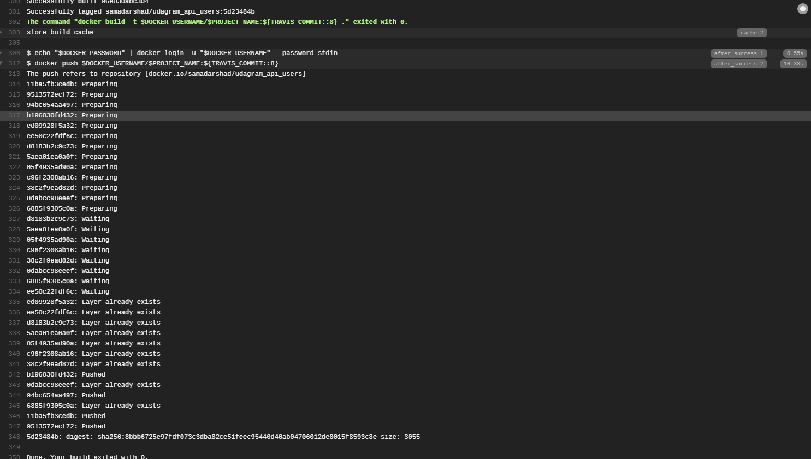

# Refactoring Monolithic App into Microservices Project Submission Notes

## Containers and Microservices
The project has been split into microservices:
- feed
- user
- frontend
- reverse proxy

DockerHub images for each microservice:

## Independent Releases and Deployments
Each project includes a .travis.yml file. Although this currently isnt needed as there are no tests. DockerHub provides its own automated CD system.

Travis automatically triggered build upon push:

Travis successful deploy to DockerHub:

DockerHub receives updated tagged image from Travis:

## Service Orchestration with Kubernetes
Kubernetes hosts API, Reverse Proxy and Frontend Web Server (note that the feed api has 2 replicas):

Kubectl Services do not expose any sensitive variables. All environment variables are passed in through secrets and config maps:

Kubernetes /feed service is replicated. Deployment.yml:

Furthermore there is autoscaling configured:

# Debugging, Monitoring, and Logging
Logs when user registers:

Logs when user uploads to feed:

## Dependancy Graph of Application Services and AWS Resources
The overall architecture/dependancy graph of the web service:

## Setting up CORS
The backend has been setup with cors, such that it only allows the browser to send requests when the browser is on the host's website.

CORS Rejection (before setting up CORS):

Setting up CORS:

CORS Acceptance (after setting up CORS):

